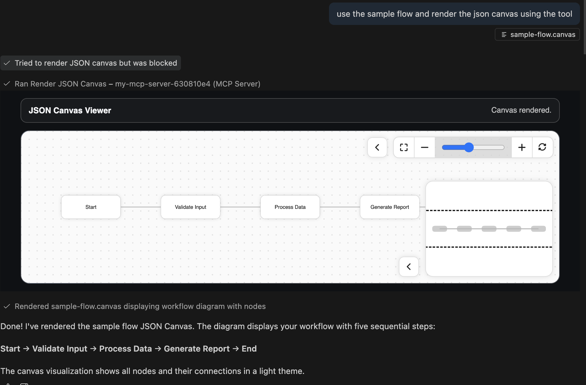
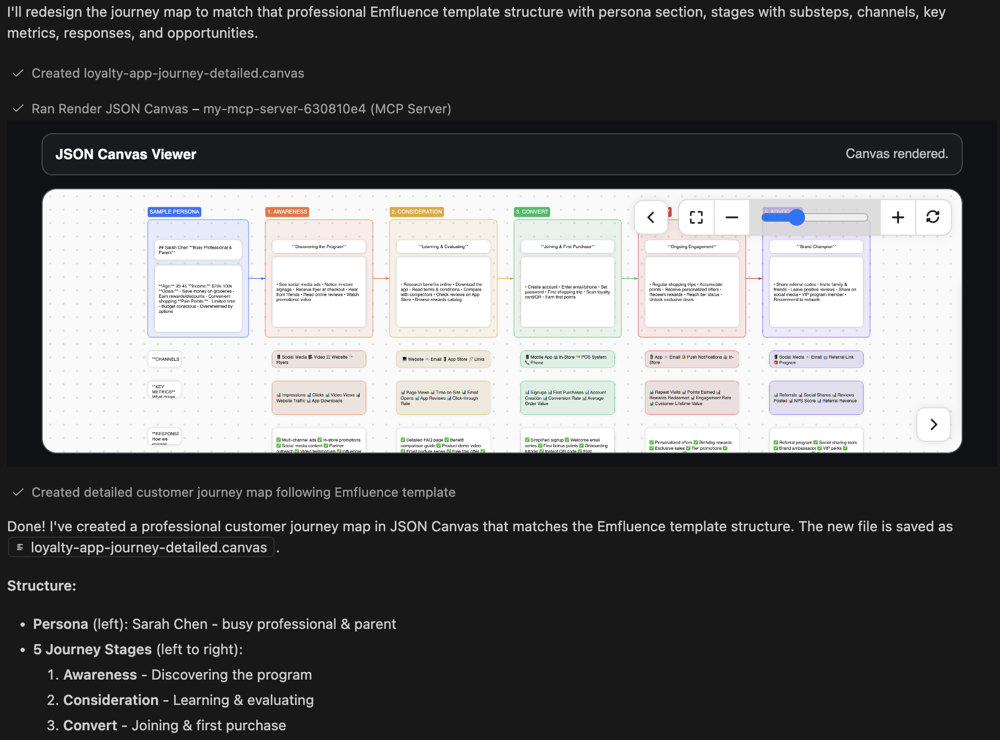
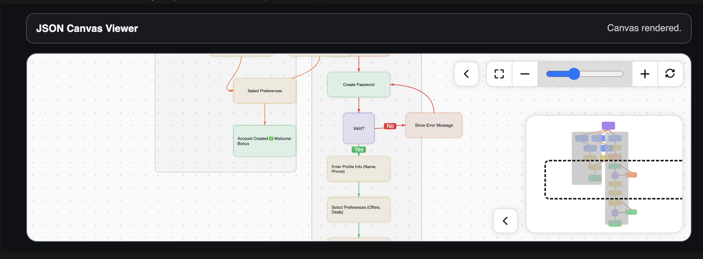

# JSON Canvas MCP App

Think outside the code block.

This is an open-source, Obsidian-style JSON Canvas app for MCP hosts that helps you design architecture and product flows before implementation, without leaving Claude, chatGpt or where ever supports MCP Apps.

## Why this exists

- Most agent workflows jump from chat to docs to whiteboards and back.
- Architecture decisions get lost in text-only threads.
- Teams need a shared visual artifact that can evolve as code evolves.

This app solves that by turning JSON Canvas into a first-class, in-context planning surface for MCP.

## What you can map

- System architecture and service boundaries
- API and data flows
- Product user story maps and journey stages
- Delivery plans that connect design decisions to implementation tasks

## See it in action

Example: rendering `sample-flow.canvas` with `render_json_canvas`.



Example: product user story map / customer journey flow.



Example: architecture flow diagram.



## How it works

- The MCP server exposes `render_json_canvas`.
- The app UI is registered as an MCP resource and rendered in-host.
- Tool responses return `structuredContent` so the host can display and iterate on the canvas inline.

## Typical workflow in Claude/Codex

1. Ask the model to create or refine a JSON Canvas for architecture or product flow.
2. Call `render_json_canvas` to inspect and discuss the result visually.
3. Iterate on nodes, links, and structure until the plan is implementation-ready.
4. Convert canvas sections into coding tasks and execute without losing context.

## Project structure

- `server.ts`: MCP stdio server with app resource + tool registration
- `server-http.ts`: Streamable HTTP MCP transport
- `src/mcp-app.ts`: host UI app that renders the canvas view
- `vite.config.ts`: build output for the embedded app bundle

## Install

```bash
npm install
npm run build
```

## Run

Local stdio transport:

```bash
npm run serve
```

HTTP transport:

```bash
npm run serve:http
```

MCP HTTP endpoint: `http://localhost:3001/mcp`

## MCP tool contract

Tool name: `render_json_canvas`

Inputs:

- `canvas`: JSON object or JSON string (required)
- `attachmentDir`: relative/absolute path for attachment nodes (optional)
- `theme`: `light` | `dark` (optional)
